# projeto-sistemas-digitais

# Tutorial: Implementação de Somador Ponto Flutuante na DE10 Lite

**Autores:** Caique Castro Rodrigues, Gustavo Soares Gama Maldonado, Henrique Chaves Lopes

**Disciplina:** Sistemas Digitais Q2.2026

**Data:** 09/08/2026

**Link do vídeo:** https://drive.google.com/file/d/1LXe5nb_bugOdzFoasKsxHLE_LbJCMqVx/view?usp=sharing

---

## 1. Objetivo do Projeto

Este projeto adapta o somador de ponto flutuante simplificado de 13 bits do livro didático (Pong P. Chu, _FPGA Prototyping by VHDL Examples_, Listings 3.19 e 3.20) para a placa Terasic DE10-Lite, que usa a FPGA Intel MAX 10 (modelo `10M50DAF484C7G`). O projeto percorre todas as etapas do fluxo: síntese, simulação e, por fim, execução na placa física.

### Formato numérico de 13 bits

O número é representado em três campos:

| Campo | Bits | Significado                        |
| ----- | ---- | ---------------------------------- |
| `s`   | 1    | sinal (0 = positivo, 1 = negativo) |
| `e`   | 4    | expoente, sem sinal (_unsigned_)   |
| `f`   | 8    | significando (fração pura `0.f`)   |

O valor representado é:

$$\text{valor} = (-1)^{s} \times 0.f \times 2^{e}$$

Diferente do IEEE 754, não existe o "1 implícito": o significando é uma fração pura menor que 1. A representação é sempre normalizada (`f(7) = '1'`) ou zero; não há números subnormais. Como o bit de sinal fica separado do valor, a aritmética é sinal e magnitude, não complemento de dois.

## 2. Descrição gráfica do funcionamento do sistema

Nesta etapa, a descrição gráfica se refere ao código VHDL do somador apresentado no artigo (Pong P. Chu, Listing 3.19, a entidade `fp_adder`). Aqui usamos exatamente as portas do artigo, ainda sem nada específico da placa; a versão com os pinos da DE10 Lite aparece na Parte 3.

O `fp_adder` recebe dois números em ponto flutuante (cada um com sinal, expoente e fração) e devolve um único resultado, também com sinal, expoente e fração.

### 2.1 Diagrama de blocos do somador `fp_adder`

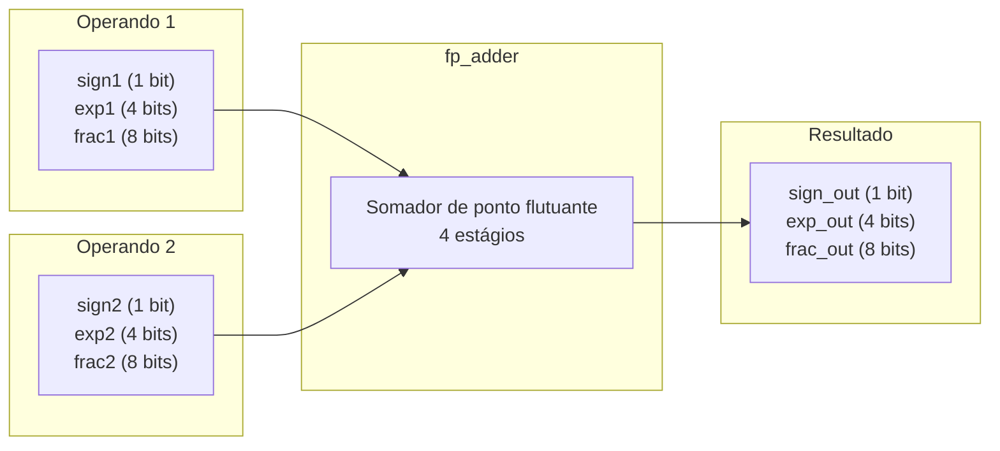

### 2.2 Fluxo interno do núcleo `fp_adder` (4 estágios)

O núcleo é puramente combinacional e reproduz, em hardware, o que se faz no papel
ao somar dois números em notação científica: primeiro descobre qual é o maior,
alinha as casas, soma (ou subtrai) e, no fim, ajusta o resultado de volta à forma
normalizada.

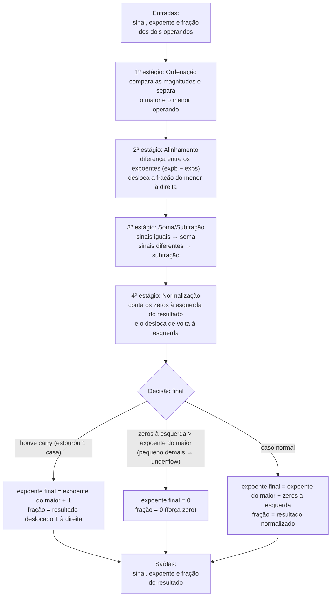

### 2.3 Glossário: do processo ao sinal do código

O texto deste relatório descreve o somador pelo que cada grandeza significa no
cálculo. A tabela abaixo é o único ponto que amarra esses termos aos nomes usados
no VHDL e nas formas de onda, caso você queira cruzar a explicação com o código:

| No processo                          | No código   | O que é                                                            |
| ------------------------------------ | ----------- | ----------------------------------------------------------------- |
| operando maior / menor               | `b` / `s`   | qual dos dois entra como maior e qual como menor após a ordenação |
| expoente do maior / do menor         | `expb` / `exps` | expoentes dos dois operandos depois de ordenados               |
| fração do menor                      | `fracs`     | fração do operando de menor magnitude                             |
| fração do menor já alinhada          | `fraca`     | a mesma fração após o deslocamento do alinhamento                 |
| diferença entre os expoentes         | `exp_diff`  | quantas casas a fração do menor precisa deslizar à direita        |
| resultado bruto da soma (9 bits)     | `sum`       | soma ou subtração das frações, com um bit extra para o carry      |
| bit de carry                         | `sum(8)`    | indica que a soma estourou uma casa a mais                        |
| zeros à esquerda                     | `leado`     | quantos zeros o resultado tem antes do primeiro `1`               |
| resultado normalizado                | `sum_norm`  | resultado já deslocado de volta à esquerda                        |
| expoente final                       | `expn`      | expoente do resultado                                             |
| fração final                         | `fracn`     | fração do resultado                                               |

### 2.4 Sinais de entrada

Cada operando entra no somador com três campos, no formato de 13 bits do artigo:

| Sinal   | Largura | Função                                               |
| ------- | ------- | ---------------------------------------------------- |
| `sign1` | 1 bit   | sinal do operando 1 (`0` = positivo, `1` = negativo) |
| `exp1`  | 4 bits  | expoente do operando 1                               |
| `frac1` | 8 bits  | significando (fração `0.f`) do operando 1            |
| `sign2` | 1 bit   | sinal do operando 2                                  |
| `exp2`  | 4 bits  | expoente do operando 2                               |
| `frac2` | 8 bits  | significando (fração `0.f`) do operando 2            |

### 2.5 Sinais de saída

O resultado sai no mesmo formato de 13 bits:

| Sinal      | Largura | Função                                   |
| ---------- | ------- | ---------------------------------------- |
| `sign_out` | 1 bit   | sinal do resultado                       |
| `exp_out`  | 4 bits  | expoente do resultado                    |
| `frac_out` | 8 bits  | significando (fração `0.f`) do resultado |

---

### 2.6 Validação por simulação (GHDL + GTKWave)

Antes de qualquer adaptação de hardware, o `fp_adder` foi validado isoladamente
com um testbench autoverificável (`tb_fp_adder.vhd`), rodado no GHDL com
visualização no GTKWave. O testbench aplica 7 casos, cada um exercitando um
caminho diferente dos 4 estágios:

| #   | Conta                 | Caminho exercitado                                               |
| --- | --------------------- | ---------------------------------------------------------------- |
| 1   | 128 + 32 = 160        | alinhamento (shift à direita de 2)                               |
| 2   | 192 + 192 = 384       | carry-out no estágio de soma                                     |
| 3   | 192 − 128 = 64        | normalização com 1 zero à esquerda                               |
| 4   | 2,0625 − 2,0 = 0      | underflow (resultado pequeno demais), força zero                 |
| 5   | 8 − 8 = −0            | cancelamento exato (expõe o zero negativo do algoritmo)          |
| 6   | 16384 + 0,996 = 16384 | alinhamento saturado (diferença de expoente ≥ 8)                 |
| 7   | 132 − 128 = 4         | normalização com 5 zeros à esquerda (maior deslocamento testado) |

A simulação terminou com todos os 7 casos aprovados:

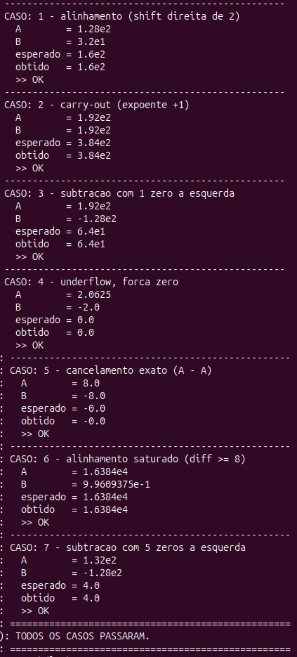

#### Observando o 4º estágio (normalização)

O circuito conta os zeros à esquerda do resultado e o desloca de volta à forma
normalizada. Dá para conferir isso nas formas de onda internas do `fp_adder`,
em dois pontos de exemplo (os nomes dos sinais nas imagens seguem o glossário da
seção 2.3: `leado` = zeros à esquerda, `sum_norm` = resultado normalizado,
`expb` = expoente do maior, `expn` = expoente final):

**Caso 3 (1 zero à esquerda):**

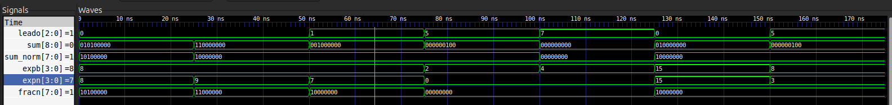

O primeiro `1` do resultado aparece uma casa adiante, então a contagem de zeros
à esquerda dá 1. A fração normalizada surge deslocada 1 casa à esquerda em relação
ao resultado bruto, e o expoente final cai uma unidade: 8 − 1 = 7, como esperado.

**Caso 7 (5 zeros à esquerda):**

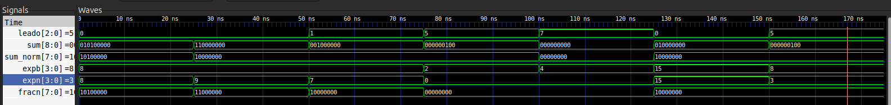

Aqui são 5 zeros à esquerda, o maior deslocamento entre os 7 testes. A fração
normalizada aparece deslocada 5 casas à esquerda e o expoente final vai de 8 para
8 − 5 = 3. O circuito se comportou da mesma forma em todo o intervalo testado
(0 a 7 zeros à esquerda), inclusive no caso limite.

## 3. Adaptações de Hardware (DE10-Lite)

### 3.1 O que mudamos no VHDL original

O código do livro foi pensado para uma placa Xilinx antiga, com 8 switches, 4 botões e um display de 4 dígitos multiplexado. Praticamente toda a parte de entrada e saída precisou ser reescrita para funcionar na DE10-Lite.

A primeira mudança foi remover o `disp_mux`. Ele existia porque a placa do livro tinha só 4 displays fisicamente ligados no mesmo barramento, então o circuito precisava alternar entre eles rápido o bastante para parecer que os 4 estavam acesos ao mesmo tempo (multiplexação temporal). A DE10-Lite tem seis displays de sete segmentos totalmente independentes, cada um com seus próprios pinos, então nada precisa ser multiplexado.

Junto com isso saiu o decodificador original (`hex_to_sseg`), porque ele usava a ordem de segmentos e a polaridade da placa do livro, que não corresponde à DE10-Lite. No lugar entrou o `hex_to_sseg_de10`, ajustado para os pinos `HEXn(0)=a` até `HEXn(6)=g` e para a lógica ativa em nível baixo (é o `'0'` que acende o segmento nesta placa).

As portas do módulo de topo também mudaram por completo: `sw(7 downto 0)` e `btn(3 downto 0)` do livro viraram `SW(9 downto 0)` e `KEY(1 downto 0)` da DE10-Lite, e o barramento multiplexado `an`/`sseg` virou os seis displays independentes `HEX0` a `HEX5`. Também acrescentamos uma saída que não existia no livro, `LEDR(9 downto 0)`, para facilitar a depuração.

A distribuição dos displays foi combinada com a professora: `HEX3` mostra o sinal do resultado (apenas o segmento do meio aceso quando é negativo), `HEX2` mostra o expoente, `HEX1` e `HEX0` dividem a fração nos dois nibbles, e `HEX4`/`HEX5` ficaram sem uso. Os LEDs seguem uma lógica parecida: `LEDR(9)` repete o sinal do resultado, `LEDR(8)` acende quando o resultado deu zero, e os 8 restantes mostram a fração em binário puro, pensado para conferir visualmente o que o somador está calculando durante os testes práticos.

Também transformamos o operando A num registrador, em vez de mantê-lo fixo. Com apenas 10 switches na placa, não é possível controlar os 26 bits dos dois operandos ao mesmo tempo, então A passou a ser carregado com `KEY0` (copia o valor atual das chaves) e limpo com `KEY1`. Foi essa mudança que abriu a possibilidade de testar qualquer par de números, inclusive os casos mais extremos, como carry-out e deslocamento grande na normalização.

Por fim, o bit mais significativo da fração do operando B foi travado em `'1'` (`fracB <= '1' & SW(4 downto 0) & "00"`), para garantir que a entrada sempre chega normalizada, como o formato exige.

Todas essas mudanças ficaram restritas ao módulo de topo: o `fp_adder.vhd`, com a lógica matemática do somador, não foi tocado. Manter o núcleo intacto significa que tudo o que validamos na simulação da Etapa 1 continua valendo, sem precisar refazer nada, na placa física.

### 3.2 O netlist sintetizado (RTL Viewer)

Depois de compilar, podemos abrir o RTL Viewer do Quartus e ver o que ele montou a partir do VHDL: o circuito de portas e registradores que o compilador sintetizou. As duas capturas abaixo são desse visualizador, tiradas numa versão intermediária do projeto, de antes do ajuste combinado com a professora (o que tirou o monitor do operando A dos displays e deixou só o resultado ocupando `HEX0` a `HEX3`). Mesmo assim vale a pena mostrar, porque podemos enxergar de um jeito bem mais concreto boa parte do que foi descrito em texto até aqui.

Na primeira imagem (abaixo) podemos ver o circuito inteiro de uma vez:

À esquerda, os três blocos de mux + registrador (`expA`, `signA`, `fracA`) são exatamente o processo do registrador do operando A, só que "desmontado" pelo sintetizador: cada bit passa primeiro por um multiplexador que decide entre manter o valor atual ou carregar um novo (a estrutura `if KEY(1)='0' ... elsif KEY(0)='0' ...` virou dois níveis de mux em cascata), e só depois entra no flip-flop propriamente dito, o bloco com `CLK` e `SCLR` (clock e clear síncrono).

No meio, o bloco verde `fp_adder:fp_add_unit` é o núcleo somador entrando como componente. O RTL Viewer não abre ele por padrão nessa visão, só mostra a caixa com a lista de portas (`exp1`, `exp2`, `frac1`, `frac2`, `sign1`, `sign2` entrando; `exp_out`, `frac_out`, `sign_out` saindo).

Ainda no meio, o círculo `Equal0` é a verificação de resultado zero virando, literalmente, um comparador de igualdade contra a constante `8'h0`: essa é a peça de hardware que gera o `zero_flag` usado no `LEDR(8)`.

À direita, cinco instâncias do `hex_to_sseg_de10`. Nessa versão, duas delas (`disp_exp_a` e `disp_frac_a`) ainda decodificavam o operando A registrado para os displays `HEX1` e `HEX0` (o monitor do operando que depois foi retirado). O sinal do resultado, por sua vez, saía por um inversor isolado (rotulado `HEX5[6]~not`) direto pro `HEX5`, em vez de passar por um decodificador: o mesmo truque de acender só o segmento do meio que hoje está no `HEX3`, só que endereçado pra outra saída física nessa versão.

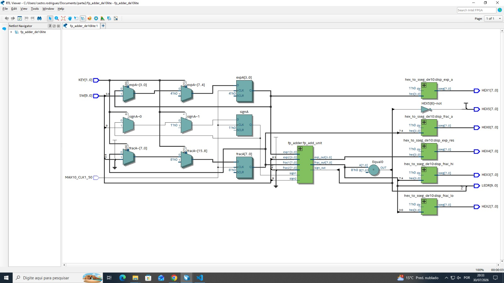

Na segunda imagem, a árvore do "Netlist Navigator" (painel da esquerda) está expandida até dentro do `fp_adder:fp_add_unit`, e dá pra ver uma peça isolada do 4º estágio: um mux rotulado `expn~[7:4]`. Essa é a lógica de decisão do expoente final do `fp_adder.vhd`, a que escolhe entre carry-out, underflow ou caso normal, já sintetizada como hardware na forma de um multiplexador selecionando entre as três opções calculadas em paralelo.

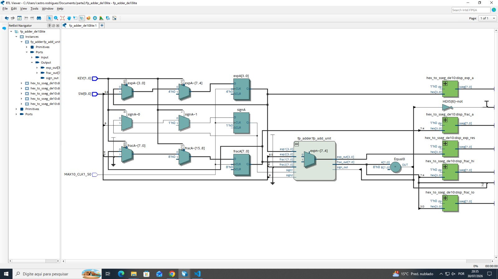

> **Obs.:** essas duas capturas são de antes da simplificação dos displays combinada com a professora, então os nomes dos sinais e o mapeamento de saídas aqui não batem 100% com o código final da Seção 4 (`HEX0` e `HEX1` aqui mostram o operando A, e o sinal sai por `HEX5` em vez de `HEX3`). O circuito por trás (o registrador de A, o núcleo `fp_adder`, o comparador de zero) é o mesmo; só a fiação de saída para os displays mudou depois, quando o operando A deixou de ser mostrado.

### 3.3 Descrição gráfica do sistema

Diagrama com as portas reais da placa (módulo de topo `fp_adder_de10lite`), refletindo o mapeamento de displays pedido pela professora (`HEX3..HEX0`, com `HEX4`/`HEX5` apagados).

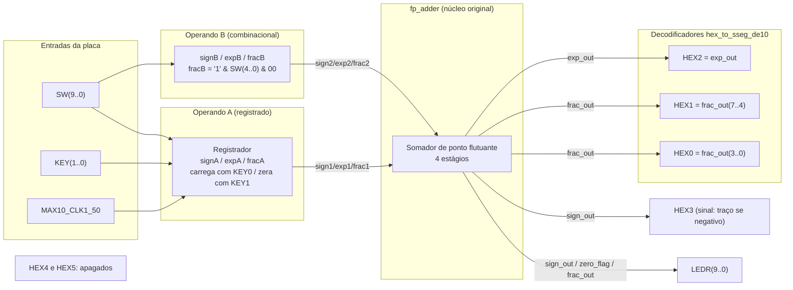

## 4. Evidências de Validação

### 4.1 Simulação

A imagem abaixo é do Questa (ModelSim), rodando o testbench `fp_adder_de10lite_vhd_tst` em cima do top-level já com os pinos da placa. Montamos o testbench para ser autoverificável. Ele aplica uma sequência de combinações de switches e pulsos de `KEY`, compara o resultado que sai do `fp_adder` com o valor esperado calculado à parte, e vai contando num sinal chamado `erros` toda vez que gera diferença. No fim da simulação, o sinal `fim_sim` sobe para `1`.

No print, o cursor está em 1440 ns, perto do fim da simulação. Nesse instante os dois sinais de controle do testbench mostram o que queríamos ver: `fim_sim = TRUE` e `erros = 0`. Todos os vetores de teste rodaram e nenhum resultado do `fp_adder` divergiu do valor esperado calculado à parte no testbench. Essa é uma verificação mais confiável do que apenas olhar a placa, pois o próprio testbench compara automaticamente cada resultado, em vez de uma pessoa conferir à mão caso por caso.

Podemos confirmar o mecanismo olhando a trilha do `KEY`, visto que ela fica alternando entre o valor `3` (`"11"`, os dois botões soltos, o estado parado entre um vetor e outro) e o valor `2` (`"10"`, ou seja `KEY(0) = '0'` pressionado) repetidas vezes ao longo da simulação, que é justamente o `KEY0` carregando um novo operando A antes de cada novo teste. Perto do fim aparece também um único pulso com o valor `1` (`"01"`, `KEY(1) = '0'`): o `KEY1` limpando o operando A, um vetor à parte só pra conferir que o clear funciona. Contando essas trocas junto com as mudanças na trilha de `SW`, podemos ver mais de dez configurações de entrada diferentes passando ao longo da simulação, cada uma seguida do pulso de `KEY` correspondente, o mesmo mecanismo que a gente testou na mão na Etapa 3, porém automatizado.

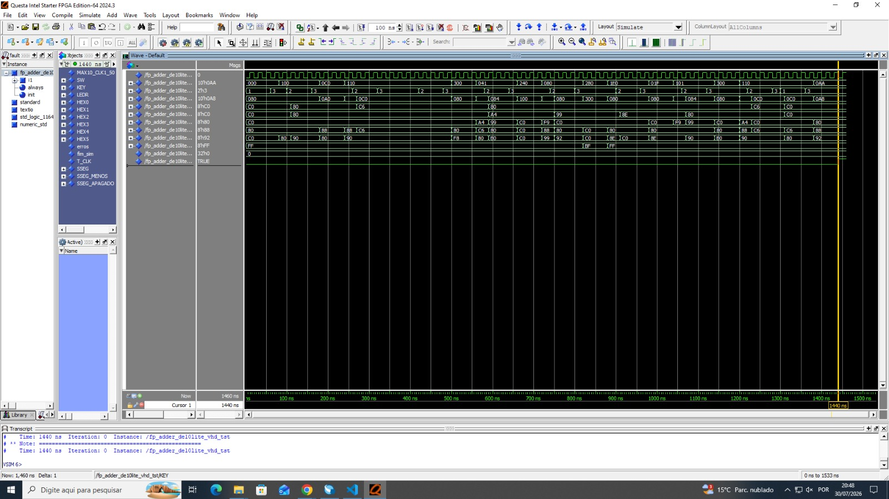

### 4.2 Código VHDL Final

#### 4.2.1. Top-level adaptado para a DE10-Lite (`fp_adder_de10lite.vhd`)

Esse é o módulo de topo que vira bitstream e roda na placa. Ele substitui o `fp_adder_test` do livro (Listing 3.20), pensado para uma placa antiga com 8 chaves, 4 botões e display multiplexado, que não é compatível com a DE10-Lite. Por isso quase tudo aqui foi reescrito; a única peça que entra sem alteração é o próprio `fp_adder`, chamado como componente.

```vhdl
library ieee;
use ieee.std_logic_1164.all;
use ieee.numeric_std.all;

entity fp_adder_de10lite is
   port(
      MAX10_CLK1_50 : in  std_logic;
      SW            : in  std_logic_vector(9 downto 0);
      KEY           : in  std_logic_vector(1 downto 0);
      LEDR          : out std_logic_vector(9 downto 0);
      HEX0          : out std_logic_vector(7 downto 0);
      HEX1          : out std_logic_vector(7 downto 0);
      HEX2          : out std_logic_vector(7 downto 0);
      HEX3          : out std_logic_vector(7 downto 0);
      HEX4          : out std_logic_vector(7 downto 0);
      HEX5          : out std_logic_vector(7 downto 0)
   );
end fp_adder_de10lite;

architecture arch of fp_adder_de10lite is

   signal signB : std_logic;
   signal expB  : std_logic_vector(3 downto 0);
   signal fracB : std_logic_vector(7 downto 0);

   signal signA : std_logic                    := '0';
   signal expA  : std_logic_vector(3 downto 0) := (others => '0');
   signal fracA : std_logic_vector(7 downto 0) := (others => '0');

   signal sign_out : std_logic;
   signal exp_out  : std_logic_vector(3 downto 0);
   signal frac_out : std_logic_vector(7 downto 0);

   signal zero_flag : std_logic;

   constant SSEG_MENOS   : std_logic_vector(7 downto 0) := "10111111";
   constant SSEG_APAGADO : std_logic_vector(7 downto 0) := "11111111";

begin

   signB <= SW(9);
   expB  <= SW(8 downto 5);
   fracB <= '1' & SW(4 downto 0) & "00";

   reg_operando_a : process(MAX10_CLK1_50)
   begin
      if rising_edge(MAX10_CLK1_50) then
         if KEY(1) = '0' then
            signA <= '0';
            expA  <= (others => '0');
            fracA <= (others => '0');
         elsif KEY(0) = '0' then
            signA <= signB;
            expA  <= expB;
            fracA <= fracB;
         end if;
      end if;
   end process;

   fp_add_unit : entity work.fp_adder
      port map (
         sign1    => signA,
         sign2    => signB,
         exp1     => expA,
         exp2     => expB,
         frac1    => fracA,
         frac2    => fracB,
         sign_out => sign_out,
         exp_out  => exp_out,
         frac_out => frac_out
      );

   zero_flag <= '1' when frac_out = "00000000" else '0';

   LEDR(9)          <= sign_out;
   LEDR(8)          <= zero_flag;
   LEDR(7 downto 0) <= frac_out;

   disp_exp_res : entity work.hex_to_sseg_de10
      port map (hex => exp_out, dp => '0', sseg => HEX2);

   disp_frac_hi : entity work.hex_to_sseg_de10
      port map (hex => frac_out(7 downto 4), dp => '0', sseg => HEX1);

   disp_frac_lo : entity work.hex_to_sseg_de10
      port map (hex => frac_out(3 downto 0), dp => '0', sseg => HEX0);

   HEX3 <= SSEG_MENOS when sign_out = '1' else SSEG_APAGADO;

   HEX4 <= SSEG_APAGADO;
   HEX5 <= SSEG_APAGADO;

end arch;
```

O bloco começa pelas portas da entidade, que trocam os nomes genéricos do livro pelos nomes reais dos pinos da placa: `SW`, `KEY`, `HEX0` a `HEX5` e `LEDR` já são reconhecidos automaticamente pelo Quartus a partir do `.qsf` da DE10-Lite. A única porta que não vinha da versão original é o clock `MAX10_CLK1_50`, que precisou entrar porque agora existe um elemento sequencial no circuito.

Logo em seguida, o operando B é ligado direto às chaves: `SW(9)` vira o sinal e `SW(8 downto 5)` vira o expoente. A fração é montada concatenando um `1` fixo (para garantir que o número entra normalizado), os 5 switches que sobraram e dois `0` no final, o que deixa apenas 5 dos 8 bits realmente controláveis. É menos precisão, mas é o preço de ter só 10 chaves para os dois operandos.

Por causa dessa mesma limitação de chaves, o operando A não pôde ficar fixo. Na primeira versão ele era uma constante, mas com 10 switches não dá para controlar os 26 bits dos dois operandos ao mesmo tempo. A saída foi transformá-lo num registrador: `KEY0` copia o que está nas chaves naquele instante e `KEY1` o zera. Esse é o único trecho sequencial do projeto; todo o resto é combinacional puro e reage na hora, sem depender do clock.

Com os dois operandos prontos, o `port map` apenas instancia o `fp_adder` da Etapa 1: liga `signA/expA/fracA` e `signB/expB/fracB` nas entradas e recolhe `sign_out/exp_out/frac_out` na saída. Não há lógica nova aqui, é o mesmo núcleo já validado sendo reaproveitado sem mudanças.

O que sobra do arquivo é a exibição do resultado. Nos LEDs, `LEDR(9)` repete o sinal, `LEDR(8)` acende quando a fração dá zero (para não ter que decorar que `0x00` é zero) e os outros 8 mostram a fração crua em binário, bit a bit, como ela sai do somador. Nos displays, cada instância de `hex_to_sseg_de10` recebe 4 bits e devolve o padrão de segmentos: `HEX2` mostra o expoente e `HEX1`/`HEX0` dividem a fração nos dois nibbles. O `HEX3` é tratado à parte, porque não precisa decodificar hexadecimal nenhum: só acende o segmento do meio quando o resultado é negativo e fica apagado quando é positivo. Já `HEX4` e `HEX5` ficaram sem uso depois que a professora pediu para tirar a memória do operando A da tela, então permanecem apagados o tempo todo.

#### 4.2.2. Decodificador de 7 segmentos adaptado (`hex_to_sseg_de10.vhd`)

Esse módulo não muda de teste para teste: é somente a tabela-verdade que transforma 4 bits num padrão de 7 segmentos. A parte que precisou de atenção foi adaptar para a polaridade da DE10-Lite.

```vhdl
library ieee;
use ieee.std_logic_1164.all;

entity hex_to_sseg_de10 is
   port(
      hex  : in  std_logic_vector(3 downto 0);
      dp   : in  std_logic;
      sseg : out std_logic_vector(7 downto 0)
   );
end hex_to_sseg_de10;

architecture arch of hex_to_sseg_de10 is
   signal seg : std_logic_vector(6 downto 0);  -- ordem: g f e d c b a
begin

   with hex select
      seg <= "0111111" when "0000",   -- 0
             "0000110" when "0001",   -- 1
             "1011011" when "0010",   -- 2
             "1001111" when "0011",   -- 3
             "1100110" when "0100",   -- 4
             "1101101" when "0101",   -- 5
             "1111101" when "0110",   -- 6
             "0000111" when "0111",   -- 7
             "1111111" when "1000",   -- 8
             "1101111" when "1001",   -- 9
             "1110111" when "1010",   -- A
             "1111100" when "1011",   -- b
             "0111001" when "1100",   -- C
             "1011110" when "1101",   -- d
             "1111001" when "1110",   -- E
             "1110001" when others;   -- F

   sseg(6 downto 0) <= not seg;
   sseg(7)          <= not dp;

end arch;
```

A tabela guarda, para cada valor de 0 a F, quais dos 7 segmentos (a até g) precisam acender para desenhar aquele número ou letra na tela. É a mesma tabela de qualquer display de 7 segmentos por aí, copiada do padrão visual conhecido, sem cálculo nenhum envolvido, apenas consulta direta.

O único ajuste específico da DE10-Lite é a inversão no fim. Nesta placa os segmentos acendem com `0`, e não com `1` (lógica ativa em nível baixo). Como é bem mais fácil escrever e revisar a tabela pensando em "`1` = aceso", ela foi montada do jeito natural e invertida de uma vez só no final, com `not seg`. O ponto decimal (`dp`) segue a mesma regra, e por isso o `not` também aparece na última linha.

---

### 4.3 Funcionamento na Placa

Abaixo, imagens do funcionamento na placa para os 6 casos testados (superando os 4 casos mínimos, incluindo casos com carry-out e com deslocamento grande na normalização).

| Caso | Operação                 | O que demonstra                                                                                                         |
| ---- | ------------------------ | ----------------------------------------------------------------------------------------------------------------------- |
| 1    | 192 + 192 = 384          | Soma com carry-out, exigindo deslocamento da mantissa para a direita e incremento do expoente na normalização.          |
| 2    | 192 − 128 = 64           | Subtração com deslocamento de 1 bit na normalização (expoente vai de 8 para 7).                                         |
| 3    | 2,0625 − 2 = 0,0625      | Resultado forçado a zero por _underflow_, sem empate de magnitudes.                                                     |
| 4    | 8 − 8 = 0                | Resultado nulo por empate exato de magnitudes, validando o tratamento do caso especial (com sinal negativo "fantasma"). |
| 5    | 16384 + 0,984375 ≈ 16384 | Operando pequeno completamente "engolido" no alinhamento, por diferença de expoente grande demais para o formato.       |
| 6    | 132 − 128 = 4            | Subtração com deslocamento grande na normalização (5 bits), o "muito deslocamento" pedido pela professora.              |

Para os casos a seguir, as conversões são montadas assim: sinal = 0 (positivo), expoente igual à primeira potência de 2 acima do número, e fração de 8 bits obtida por arredondar $N / 2^e \times 256$. As chaves SW mapeiam sinal, expoente e os cinco bits centrais da fração (bits 6 a 2, já que o primeiro é fixo em 1 e os dois últimos em 0). O somador executa ordenação, alinhamento, soma e normalização, e o resultado é exibido como sinal, expoente hexadecimal e dois dígitos hex da fração, com valor recuperado por $\text{fração} / 256 \times 2^{\text{expoente}}$. O método será esclarecido em cada caso isolado.

---

#### Caso 1: 192 + 192 = 384 (carry-out)

Este caso força um _carry-out_ na soma dos significandos, testando o primeiro segmento de decisão da normalização (incremento do expoente).

Os dois operandos são iguais: 192.

- Primeira potência de 2 acima de 192 → `2^8 = 256`, então expoente = 8 (binário `1000`).
- `192 / 256 = 0,75`; `× 256 = 192` → fração = 192 = binário `11000000`.

Como A = B = 192, as mesmas chaves servem para os dois operandos:

| Operando | Valor | `SW9` (sinal) | `SW8`        | `SW7`     | `SW6`     | `SW5`     | `SW4`        | `SW3`     | `SW2`     | `SW1`     | `SW0`     |
| -------- | ----- | ------------- | ------------ | --------- | --------- | --------- | ------------ | --------- | --------- | --------- | --------- |
| A = B    | 192   | 0 (baixo)     | **1 (cima)** | 0 (baixo) | 0 (baixo) | 0 (baixo) | **1 (cima)** | 0 (baixo) | 0 (baixo) | 0 (baixo) | 0 (baixo) |

**Roteiro para testar na placa:**

1. Deixe as chaves `SW8` e `SW4` para cima, todas as outras para baixo → monta 192.
2. Aperte e solte `KEY0` para guardar 192 como operando A.
3. Não mexa em mais nada: o operando B já está com o mesmo valor (192) nas chaves.
4. O resultado (384) aparece direto nos displays (circuito combinacional).

**Os 4 estágios:**

Com A = B = 192 (expoente 8, fração `11000000`):

1. **Ordenação:** as duas magnitudes são iguais; como os operandos são idênticos, tanto faz qual entra como maior.
2. **Alinhamento:** os expoentes são iguais (8 e 8), então nenhuma fração precisa deslizar.
3. **Soma:** sinais iguais, então soma: `11000000` (192) `+ 11000000` (192) `= 110000000` (384 em 9 bits). O `1` que sobra na frente é o carry: o resultado estourou uma casa.
4. **Normalização:** como houve carry, o circuito desloca a fração 1 bit à direita e soma 1 ao expoente. O expoente final vira 8 + 1 = 9 e a fração volta a ser `11000000` (192).

Resultado: sinal `+`, expoente 9, fração 192 (`11000000` = `0xC0`). Em decimal: `192 / 256 × 2^9 = 0,75 × 512 = 384`.

| Display | Mostra                   | Neste exemplo      |
| ------- | ------------------------ | ------------------ |
| `HEX3`  | sinal                    | apagado (positivo) |
| `HEX2`  | expoente, em hexadecimal | `9`                |
| `HEX1`  | 4 bits altos da fração   | `C` (`1100`)       |
| `HEX0`  | 4 bits baixos da fração  | `0`                |

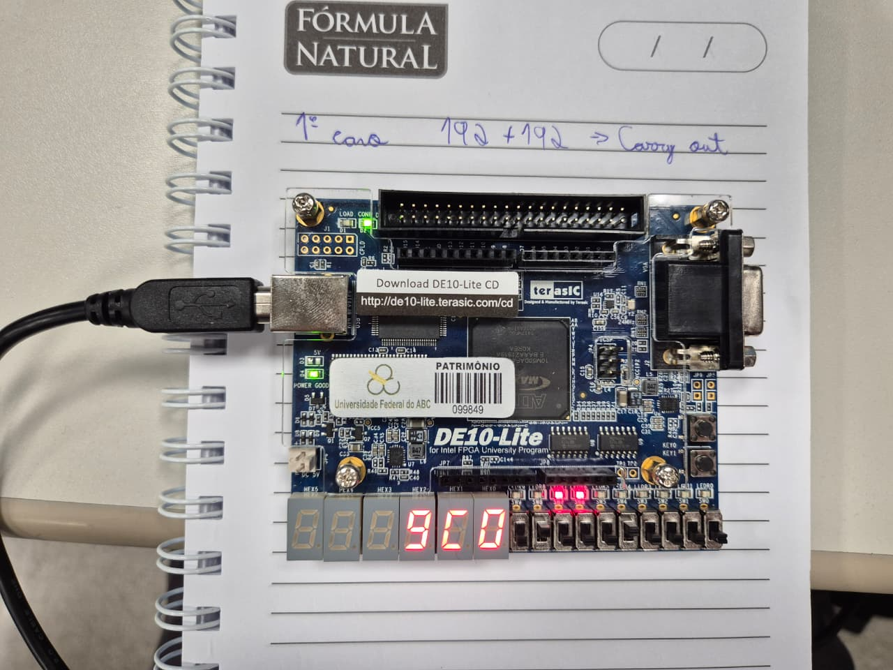

---

#### Caso 2: 192 − 128 = 64 (deslocamento de 1 bit na normalização)

Este caso testa um deslocamento pequeno (1 bit) no 4º estágio, complementando o Caso 6 (deslocamento de 5 bits) com um exemplo mais simples do mesmo mecanismo.

**Para o 192** (mesmo cálculo do Caso 1):

- expoente = 8 (`1000`); fração = 192 (`11000000`).

**Para o 128** (entra negativo, para fazer `192 + (−128)`):

- Primeira potência de 2 acima de 128 → `2^8 = 256`, então expoente = 8 (`1000`).
- `128 / 256 = 0,5`; `× 256 = 128` → fração = 128 = `10000000`.

| Operando | Valor | `SW9` (sinal) | `SW8`        | `SW7`     | `SW6`     | `SW5`     | `SW4`        | `SW3`     | `SW2`     | `SW1`     | `SW0`     |
| -------- | ----- | ------------- | ------------ | --------- | --------- | --------- | ------------ | --------- | --------- | --------- | --------- |
| A        | +192  | 0 (baixo)     | **1 (cima)** | 0 (baixo) | 0 (baixo) | 0 (baixo) | **1 (cima)** | 0 (baixo) | 0 (baixo) | 0 (baixo) | 0 (baixo) |
| B        | −128  | **1 (cima)**  | **1 (cima)** | 0 (baixo) | 0 (baixo) | 0 (baixo) | 0 (baixo)    | 0 (baixo) | 0 (baixo) | 0 (baixo) | 0 (baixo) |

**Roteiro para testar na placa:**

1. Suba `SW8` e `SW4` (demais para baixo) → monta 192.
2. Aperte e solte `KEY0` para guardar 192 como operando A.
3. Suba `SW9` (sinal negativo) e abaixe `SW4`, mantendo `SW8` levantado → representa −128 como operando B.
4. O resultado (64) aparece direto nos displays.

**Os 4 estágios:**

Com A = 192 (expoente 8, fração `11000000`, sinal +) e B = 128 (expoente 8, fração `10000000`, sinal −):

1. **Ordenação:** mesmo expoente, então compara as frações: `192 > 128`, logo A é o maior (positivo) e B o menor (negativo).
2. **Alinhamento:** os expoentes são iguais (8 e 8), nenhuma fração desliza.
3. **Subtração:** sinais diferentes, então subtrai: `11000000` (192) `− 10000000` (128) `= 01000000` (64), sem carry.
4. **Normalização:** contando os zeros à esquerda em `01000000`, o primeiro `1` aparece uma casa adiante, então é 1 zero à esquerda. Como 1 zero não passa do expoente do maior (8), é o caso normal: desloca a fração 1 bit à esquerda e tira 1 do expoente. O expoente final vira 8 − 1 = 7 e a fração vira `10000000` (128).

Resultado: sinal `+`, expoente 7, fração 128 (`10000000` = `0x80`). Em decimal: `128 / 256 × 2^7 = 0,5 × 128 = 64`. E de fato 192 − 128 = 64.

| Display | Mostra                   | Neste exemplo      |
| ------- | ------------------------ | ------------------ |
| `HEX3`  | sinal                    | apagado (positivo) |
| `HEX2`  | expoente, em hexadecimal | `7`                |
| `HEX1`  | 4 bits altos da fração   | `8`                |
| `HEX0`  | 4 bits baixos da fração  | `0`                |

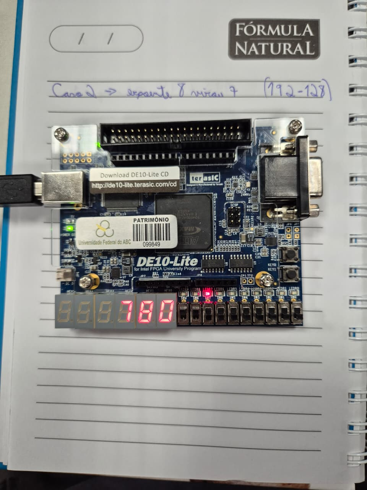

---

#### Caso 3: 2,0625 − 2 = 0,0625 (underflow, sem empate de magnitudes)

Este caso mostra um segundo caminho para o resultado ser forçado a zero: não por empate exato de magnitudes (como no Caso 4), mas porque a diferença real é menor do que o menor número normalizado representável no formato (`0,5 × 2⁰ = 0,5`).

**Para o 2,0625:**

- Primeira potência de 2 acima de 2,0625 → `2^2 = 4`, então expoente = 2 (`0010`).
- `2,0625 / 4 = 0,515625`; `× 256 = 132` → fração = 132 = `10000100`.

**Para o 2** (entra negativo, para fazer `2,0625 + (−2)`):

- Primeira potência de 2 acima de 2 → `2^2 = 4` (não pode ser `2^1 = 2`, pois `2 / 2 = 1,0` fica fora da faixa `[0,5 , 1)`), então expoente = 2.
- `2 / 4 = 0,5`; `× 256 = 128` → fração = 128 = `10000000`.

| Operando | Valor   | `SW9` (sinal) | `SW8`     | `SW7`     | `SW6`        | `SW5`     | `SW4`     | `SW3`     | `SW2`     | `SW1`     | `SW0`        |
| -------- | ------- | ------------- | --------- | --------- | ------------ | --------- | --------- | --------- | --------- | --------- | ------------ |
| A        | +2,0625 | 0 (baixo)     | 0 (baixo) | 0 (baixo) | **1 (cima)** | 0 (baixo) | 0 (baixo) | 0 (baixo) | 0 (baixo) | 0 (baixo) | **1 (cima)** |
| B        | −2      | **1 (cima)**  | 0 (baixo) | 0 (baixo) | **1 (cima)** | 0 (baixo) | 0 (baixo) | 0 (baixo) | 0 (baixo) | 0 (baixo) | 0 (baixo)    |

**Roteiro para testar na placa:**

1. Suba `SW6` e `SW0` (demais para baixo) → monta 2,0625.
2. Aperte e solte `KEY0` para guardar como operando A.
3. Suba `SW9` (sinal negativo), mantenha `SW6` levantado, abaixe `SW0` → representa −2 como operando B.
4. O resultado (zero) aparece direto nos displays.

**Os 4 estágios:**

Com A = 2,0625 (expoente 2, fração `10000100`, sinal +) e B = 2 (expoente 2, fração `10000000`, sinal −):

1. **Ordenação:** mesmo expoente, então compara as frações: `132 > 128`, logo A é o maior (positivo) e B o menor (negativo).
2. **Alinhamento:** os expoentes são iguais, nenhuma fração desliza.
3. **Subtração:** sinais diferentes, então subtrai: `10000100 − 10000000 = 00000100` (4), sem carry.
4. **Normalização:** contando os zeros à esquerda em `00000100`, o primeiro `1` só aparece na terceira casa a partir do fim, então são 5 zeros à esquerda. Como os 5 zeros passam do expoente do maior (2), o circuito reconhece que o deslocamento necessário é maior do que o próprio expoente disponível (o número é pequeno demais para ser normalizado) e força expoente final 0 e fração 0.

Resultado: expoente 0, fração 0, ou seja, zero. Como o maior desta vez foi A (positivo), o sinal do resultado é positivo, então o `HEX3` fica apagado, diferente do Caso 4, onde o maior era o operando negativo.

| Display | Mostra                   | Neste exemplo      |
| ------- | ------------------------ | ------------------ |
| `HEX3`  | sinal                    | apagado (positivo) |
| `HEX2`  | expoente, em hexadecimal | `0`                |
| `HEX1`  | 4 bits altos da fração   | `0`                |
| `HEX0`  | 4 bits baixos da fração  | `0`                |

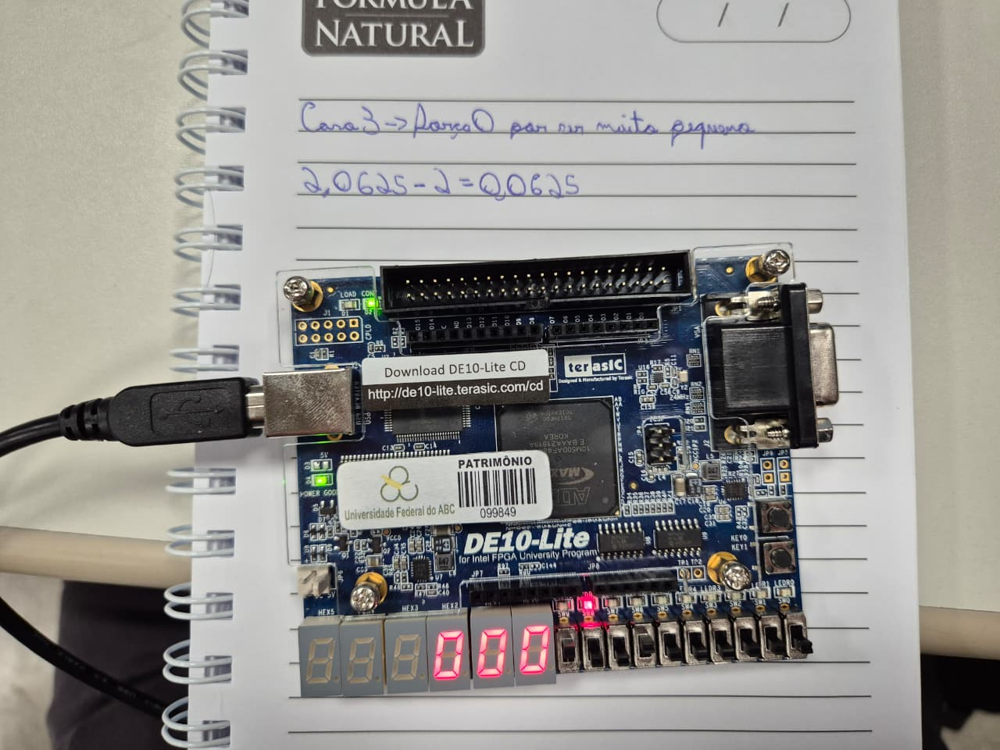

---

#### Caso 4: 8 − 8 = 0 (resultado nulo)

Este caso valida a condição especial de zero: quando o resultado é pequeno demais para ser normalizado, o circuito força expoente e fração em zero. No entanto, como descobrimos durante a apresentação (será detalhado no Caso 7), alguns casos de resultado nulo mostram o expoente diferente de zero, embora a fração seja sempre nula.

**Para o 8:**

- Primeira potência de 2 acima de 8 → `2^4 = 16`, então expoente = 4 (`0100`).
- `8 / 16 = 0,5`; `× 256 = 128` → fração = 128 = `10000000`.

O segundo operando é o mesmo valor (8), mas com o sinal negativo, para fazer `8 + (−8)`.

| Operando | Valor | `SW9` (sinal) | `SW8`     | `SW7`        | `SW6`     | `SW5`     | `SW4`     | `SW3`     | `SW2`     | `SW1`     | `SW0`     |
| -------- | ----- | ------------- | --------- | ------------ | --------- | --------- | --------- | --------- | --------- | --------- | --------- |
| A        | +8    | 0 (baixo)     | 0 (baixo) | **1 (cima)** | 0 (baixo) | 0 (baixo) | 0 (baixo) | 0 (baixo) | 0 (baixo) | 0 (baixo) | 0 (baixo) |
| B        | −8    | **1 (cima)**  | 0 (baixo) | **1 (cima)** | 0 (baixo) | 0 (baixo) | 0 (baixo) | 0 (baixo) | 0 (baixo) | 0 (baixo) | 0 (baixo) |

**Roteiro para testar na placa:**

1. Monte +8 nas chaves (só `SW7` para cima) e aperte `KEY0` para guardar como operando A.
2. Suba também `SW9` (sinal negativo), mantendo `SW7` para cima → as chaves agora representam −8 (operando B).
3. O resultado (zero) aparece direto nos displays.

**Os 4 estágios:**

Com A = +8 e B = −8 (ambos exp 4, frac `10000000`):

1. **Ordenação:** expoente e fração de A e B são idênticos, então o circuito não encontra um maior estrito. Pelo critério de desempate do algoritmo, B entra como maior e A como menor, e é o sinal de B (negativo) que passa a valer como sinal do maior.
2. **Alinhamento:** os expoentes são iguais, nenhuma fração desliza.
3. **Subtração:** sinais diferentes (o maior é negativo, o menor positivo), então subtrai: `10000000 − 10000000 = 00000000`, sem carry.
4. **Normalização:** o resultado é todo zero, então o contador de zeros à esquerda satura no seu valor máximo (7). Como esse 7 passa do expoente do maior (4), o circuito reconhece que o número é pequeno demais para ser normalizado e força expoente final 0 e fração 0.

Resultado: expoente 0, fração 0, ou seja, zero.

> **Por que o sinal "sobra" apesar do resultado ser zero?** Porque o sinal do resultado é decidido logo no 1º estágio, antes de qualquer soma, apenas comparando as magnitudes dos dois operandos. Quando os valores são exatamente iguais (como 8 e 8), nenhum é maior, o circuito cai no critério de desempate e copia o sinal do segundo operando, que neste teste é negativo. Esse sinal fica gravado e vai direto para a saída, sem nunca ser reavaliado.
>
> O quarto estágio, mais tarde, detecta que o resultado é zero e zera `exp_out` e `frac_out`, mas já não consegue “avisar” o primeiro estágio para também zerar o sinal, que já foi definido e propagado. Resultado: os dígitos mostram zero corretamente, mas o traço negativo pode continuar aparecendo no `HEX3`.

| Display   | Mostra                     | Neste exemplo                               |
| --------- | -------------------------- | ------------------------------------------- |
| `HEX3`    | sinal                      | pode mostrar o traço (ver observação acima) |
| `HEX2`    | expoente, em hexadecimal   | `0`                                         |
| `HEX1`    | 4 bits altos da fração     | `0`                                         |
| `HEX0`    | 4 bits baixos da fração    | `0`                                         |
| `LEDR(8)` | flag de zero (`zero_flag`) | aceso (`1`)                                 |

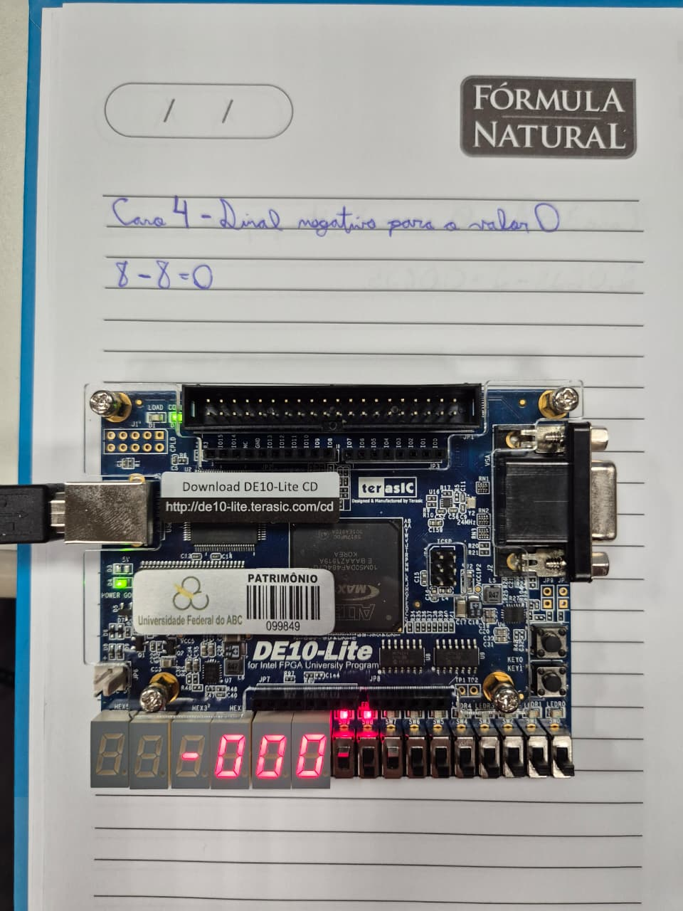

---

#### Caso 5: 16384 + 0,984375 ≈ 16384 (operando pequeno "engolido")

Este caso mostra o que acontece quando a diferença de expoentes entre os dois operandos é grande demais. A fração do operando menor desliza para fora de todos os 8 bits durante o alinhamento e some por completo, como se fosse somado zero.

**Para o 16384:**

- Primeira potência de 2 acima → `2^15 = 32768`, então expoente = 15 (`1111`).
- `16384 / 32768 = 0,5`; `× 256 = 128` → fração = 128 = `10000000`.

**Para o 0,984375:**

- Primeira potência de 2 acima → `2^0 = 1`, então expoente = 0 (`0000`).
- `0,984375 / 1 = 0,984375`; `× 256 = 252` → fração = 252 = `11111100`.

| Operando | Valor     | `SW9` (sinal) | `SW8`        | `SW7`        | `SW6`        | `SW5`        | `SW4`        | `SW3`        | `SW2`        | `SW1`        | `SW0`        |
| -------- | --------- | ------------- | ------------ | ------------ | ------------ | ------------ | ------------ | ------------ | ------------ | ------------ | ------------ |
| A        | +16384    | 0 (baixo)     | **1 (cima)** | **1 (cima)** | **1 (cima)** | **1 (cima)** | 0 (baixo)    | 0 (baixo)    | 0 (baixo)    | 0 (baixo)    | 0 (baixo)    |
| B        | +0,984375 | 0 (baixo)     | 0 (baixo)    | 0 (baixo)    | 0 (baixo)    | 0 (baixo)    | **1 (cima)** | **1 (cima)** | **1 (cima)** | **1 (cima)** | **1 (cima)** |

**Roteiro para testar na placa:**

1. Suba `SW8`, `SW7`, `SW6` e `SW5` (demais para baixo) → monta 16384.
2. Aperte e solte `KEY0` para guardar como operando A.
3. Abaixe `SW8` a `SW5` e suba todas as chaves da fração (`SW4` a `SW0`) → representa 0,984375 como operando B.
4. O resultado aparece direto nos displays.

**Os 4 estágios:**

Com A = 16384 (exp 15, frac `10000000`) e B = 0,984375 (exp 0, frac `11111100`):

1. **Ordenação:** A tem expoente muito maior (15 contra 0), então entra como maior; B é o menor.
2. **Alinhamento:** a diferença de expoentes é 15 − 0 = 15. O deslocamento necessário é maior do que os 8 bits da fração de B: ela desliza inteira para fora e a fração alinhada vira `00000000`. O operando menor é completamente descartado nesta etapa, antes mesmo da soma.
3. **Soma:** sinais iguais → soma: `10000000 + 00000000 = 10000000` (128), sem carry.
4. **Normalização:** a fração já começa com `1`, então não há zeros à esquerda nem deslocamento. O expoente final é o mesmo do maior: 15.

Resultado: sinal `+`, expoente 15, fração 128 (`0x80`), exatamente igual ao valor original de A. Somar 0,984 a 16384 não mudou nada visível no resultado, porque a diferença de magnitude é grande demais para o formato de 13 bits capturar.

| Display | Mostra                   | Neste exemplo      |
| ------- | ------------------------ | ------------------ |
| `HEX3`  | sinal                    | apagado (positivo) |
| `HEX2`  | expoente, em hexadecimal | `F`                |
| `HEX1`  | 4 bits altos da fração   | `8`                |
| `HEX0`  | 4 bits baixos da fração  | `0`                |

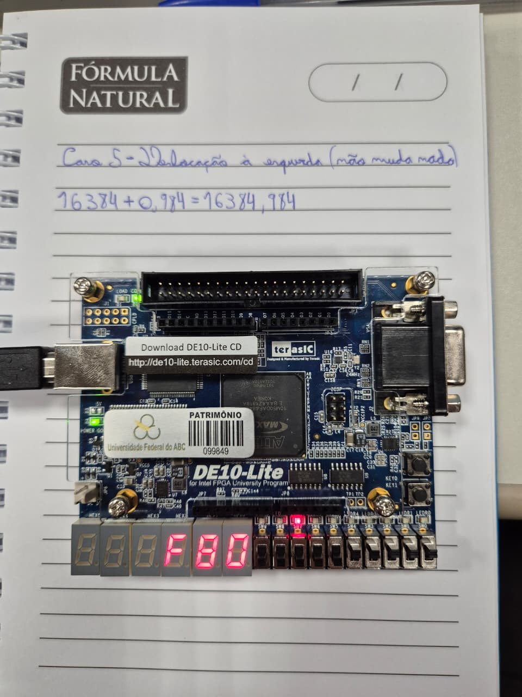

---

#### Caso 6: 132 − 128 = 4 (deslocamento de 5 bits na normalização)

Este caso testa o segmento de contagem/deslocamento de zeros à esquerda no 4º estágio, usado quando a subtração produz um resultado com vários bits mais significativos zerados. Escolhemos um par de números com deslocamento maior (5 bits) para deixar bem evidente o grande deslocamento nesta etapa.

**Para o 132:**

- Primeira potência de 2 acima de 132 → `2^8 = 256`, então expoente = 8 (`1000`).
- `132 / 256 = 0,515625`; `× 256 = 132` → fração = 132 = `10000100`.

**Para o 128:**

- Primeira potência de 2 acima de 128 → `2^8 = 256`, então expoente = 8.
- `128 / 256 = 0,5`; `× 256 = 128` → fração = 128 = `10000000`.

Como é uma subtração (132 − 128), o 128 entra com o bit de sinal ligado (negativo): o somador soma quando os sinais são iguais e subtrai quando são diferentes, então isso equivale a calcular `132 + (−128)`.

| Operando | Valor | `SW9` (sinal) | `SW8`        | `SW7`     | `SW6`     | `SW5`     | `SW4`     | `SW3`     | `SW2`     | `SW1`     | `SW0`        |
| -------- | ----- | ------------- | ------------ | --------- | --------- | --------- | --------- | --------- | --------- | --------- | ------------ |
| A        | +132  | 0 (baixo)     | **1 (cima)** | 0 (baixo) | 0 (baixo) | 0 (baixo) | 0 (baixo) | 0 (baixo) | 0 (baixo) | 0 (baixo) | **1 (cima)** |
| B        | −128  | **1 (cima)**  | **1 (cima)** | 0 (baixo) | 0 (baixo) | 0 (baixo) | 0 (baixo) | 0 (baixo) | 0 (baixo) | 0 (baixo) | 0 (baixo)    |

**Roteiro para testar na placa:**

1. Suba `SW8` e `SW0` (demais para baixo) → monta 132.
2. Aperte e solte `KEY0` para guardar como operando A.
3. Suba também `SW9` (sinal negativo), mantenha `SW8` levantado e abaixe `SW0` → representa −128 como operando B.
4. O resultado (4) aparece direto nos displays.

**Os 4 estágios:**

Com A = 132 (exp 8, frac `10000100`, sinal +) e B = 128 (exp 8, frac `10000000`, sinal −):

1. **Ordenação:** mesmo expoente, então o circuito compara as frações: `132 > 128`, logo A (132) entra como maior e B (128) como menor.
2. **Alinhamento:** os expoentes são iguais (8 e 8), nenhuma fração desliza.
3. **Subtração:** sinais diferentes, então subtrai: `10000100` (132) `− 10000000` (128) `= 00000100` (4), sem carry.
4. **Normalização:** contando os zeros à esquerda em `00000100`, o primeiro `1` só aparece na terceira casa a partir do fim, então são 5 zeros à esquerda. Como 5 zeros não passam do expoente do maior (8), é o caso normal: o circuito desloca a fração 5 bits à esquerda e tira 5 do expoente. O expoente final vira 8 − 5 = 3 e a fração vira `10000000` (128).

Resultado: sinal `+` (herdado do operando de maior magnitude, 132), expoente 3, fração 128 (`10000000` = `0x80`). Em decimal: `128 / 256 × 2^3 = 0,5 × 8 = 4`.

| Display | Mostra                   | Neste exemplo      |
| ------- | ------------------------ | ------------------ |
| `HEX3`  | sinal                    | apagado (positivo) |
| `HEX2`  | expoente, em hexadecimal | `3`                |
| `HEX1`  | 4 bits altos da fração   | `8`                |
| `HEX0`  | 4 bits baixos da fração  | `0`                |

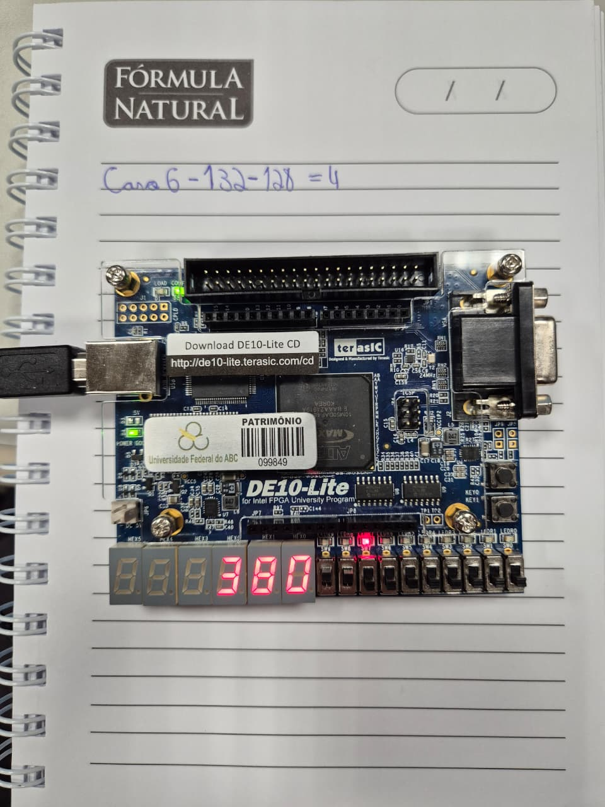

---

#### Caso 7 (sem foto): 992 − 992 = 0, mas o expoente não zera

Descobrimos este caso durante a apresentação do trabalho, por isso não registramos foto. Nele, como no Caso 4, um número é subtraído de si mesmo e, assim, a fração é zerada. Contudo, há casos em que o expoente continua diferente de zero, como em 992 - 992.

**Para o 992:**

- A primeira potência de 2 acima dele é `2^10 = 1024`, então o expoente é 10 (`1010`). `992 / 1024 = 0,96875`, e multiplicando por 256 dá `248`, então a fração é 248 (`11111000`).

O segundo operando é o mesmo valor, só que negativo, pra fazer `992 + (−992)`.

| Operando | Valor | `SW9` (sinal) | `SW8`        | `SW7`     | `SW6`        | `SW5`     | `SW4`        | `SW3`        | `SW2`        | `SW1`        | `SW0`     |
| -------- | ----- | ------------- | ------------ | --------- | ------------ | --------- | ------------ | ------------ | ------------ | ------------ | --------- |
| A        | +992  | 0 (baixo)     | **1 (cima)** | 0 (baixo) | **1 (cima)** | 0 (baixo) | **1 (cima)** | **1 (cima)** | **1 (cima)** | **1 (cima)** | 0 (baixo) |
| B        | −992  | **1 (cima)**  | **1 (cima)** | 0 (baixo) | **1 (cima)** | 0 (baixo) | **1 (cima)** | **1 (cima)** | **1 (cima)** | **1 (cima)** | 0 (baixo) |

**Roteiro para testar na placa**

1. Suba `SW8` e `SW6` (expoente 10), demais chaves de expoente para baixo.
2. Suba `SW4`, `SW3`, `SW2` e `SW1` (fração 248), deixe `SW0` para baixo.
3. Aperte e solte `KEY0` para guardar 992 como operando A.
4. Suba também `SW9` (sinal negativo), mantendo o resto igual. Isso representa −992 como operando B.
5. O resultado aparece direto nos displays.

**Os 4 estágios:**

Com A = +992 (expoente 10, fração `11111000`) e B = −992 (expoente 10, fração `11111000`):

1. **Ordenação:** magnitude idêntica nos dois operandos, então o circuito não encontra um maior estrito e, pelo critério de desempate, B entra como maior e A como menor. É o sinal negativo de B que passa a valer como sinal do maior, o mesmo mecanismo do Caso 4.
2. **Alinhamento:** os expoentes são iguais (10 e 10), nenhuma fração desliza.
3. **Subtração:** sinais diferentes, então `11111000 − 11111000 = 00000000`, sem carry.
4. **Normalização:** o resultado é todo zero, então o contador de zeros à esquerda satura no seu máximo, 7 (o contador `leado` só tem 3 bits, então não consegue chegar a 8, mesmo com as 8 posições zeradas). O teste que decide o underflow é "zeros à esquerda maior que o expoente do maior". Aqui o expoente do maior é 10, e 7 não é maior que 10, então o circuito não entra no ramo que zera o resultado: cai no caso normal e calcula o expoente final como 10 − 7 = 3, com a fração normalizada dando `00000000`.

Resultado: sinal negativo (herdado de B), expoente 3 (`0011`), fração 0. A fração e o sinal saem certos, mas o expoente sai 3 em vez de 0.

| Display | Mostra                   | Neste exemplo                        |
| ------- | ------------------------ | ------------------------------------ |
| `HEX3`  | sinal                    | traço aceso (negativo, herdado de B) |
| `HEX2`  | expoente, em hexadecimal | `3` (errado, devia ser `0`)          |
| `HEX1`  | 4 bits altos da fração   | `0`                                  |
| `HEX0`  | 4 bits baixos da fração  | `0`                                  |

Por que isso não acontece no Caso 4 (`8 − 8`)? Lá o expoente do 8 é 4. A mesma conta dá 7 zeros à esquerda, e como 7 é maior que 4, o circuito cai no ramo que força tudo a zero. O ponto de virada é o expoente 7: com expoente do maior igual a 7, o 7 já não é maior, então o circuito cai no caso normal e calcula 7 − 7 = 0, que por coincidência ainda dá certo. O erro só fica visível a partir do expoente 8, quando a conta "expoente do maior − 7" deixa de dar zero.

A causa é o próprio contador de zeros à esquerda, declarado no VHDL com só 3 bits (`signal leado : unsigned(2 downto 0)`). Três bits alcançam no máximo o valor 7, mas para sinalizar "nenhum `1` encontrado nos 8 bits do resultado" seria preciso o valor 8, que não cabe nesse tamanho. O teste de underflow só detecta o caso por coincidência, enquanto o expoente for pequeno o bastante. Uma pequena limitação do algoritmo original do livro.

## 5. Diário de Bordo de IA

Utilizamos o **Claude** como ferramenta de apoio ao longo do
projeto, principalmente para acelerar a escrita do testbench, apoiar a
refatoração do circuito de teste e tirar dúvidas sobre o algoritmo do livro.

---

### 5.1 Como conduzimos o uso da ferramenta

Primeiro entendemos o
artigo (Pong P. Chu, seção 3.7.4), depois usamos a IA para checar nosso
entendimento, gerar rascunhos e, principalmente, para nos forçar a justificar
cada decisão. Além de termos utilizado para nos auxiliar no uso do Questa, uma vez que nenhum integrante do grupo tinha muita familiaridade com o sistema.

#### Prompts utilizados

Registramos abaixo os prompts mais representativos, na ordem em que a
investigação evoluiu. A conversa completa está anexada em PDF.

> "Explique o 4º estágio (normalização) do somador de ponto flutuante do
> Listing 3.19 do Pong P. Chu. Por que existem três condições diferentes
> (`sum(8)='1'`, `leado > expb`, e o caso normal)? Quero entender o que cada
> uma representa fisicamente antes de mexer no hardware."

> "Compilamos o VHDL do PDF e ele não passou no GHDL. Os erros são em `'0 '` e
> `= >`. Isso é erro de lógica ou de extração do PDF? Como confirmar que a
> lógica está intacta?"

> "A placa do livro tinha 4 displays multiplexados e a DE10-Lite tem 6
> independentes. Faz sentido remover o módulo `disp_mux`? Quais consequências
> isso tem para o resto do circuito de teste?"

> "Queremos um testbench no mesmo formato do Lab 2 (gerado pelo Test Bench
> Template Writer do Quartus, com processos `init` e `always`), mas
> auto-verificável, que compare cada saída com o valor esperado e conte os
> erros. Como estruturar? Quais os passos podemos seguir no Questa desde o teste até conectar na placa?"

> "Quais casos de teste cobrem as três condições de normalização descritas na
> seção 3.7.4 do texto? Queremos que cada caso rastreie para um exemplo ou
> para uma decisão nossa, não escolher números no olho."

> "Com todas as chaves para baixo, o que os LEDs deveriam mostrar? Queremos
> um teste para saber se a gravação funcionou."

> "Precisamos remover a memória do operando A dos displays
> (HEX1/HEX0) e usar só 4 displays. O que precisa mudar no `.vhd` e no
> testbench para não quebrar a validação?"

> "Como deixar nosso relatório em Markdown mais bonito e legível para o GitHub? queremos só a apresentação mais limpa."

> "Queremos representar os fluxos do projeto com diagramas Mermaid embutidos no Markdown (que o GitHub renderiza sozinho), em vez de imagens soltas. Precisamos de: (1) um diagrama de blocos do fp_adder mostrando os dois operandos entrando e o resultado saindo; (2) um fluxograma dos 4 estágios internos (ordenação → alinhamento → soma/subtração → normalização), com a decisão final da normalização ramificando em carry-out, underflow e caso normal; (3) um diagrama do top-level da placa ligando SW/KEY/clock aos displays e LEDs. Gere o código Mermaid e explique para conseguirmos ajustar depois."

---

### 5.2 Os erros da IA

#### Erro 1: Pinos e padrão elétrico assumidos de memória

**O que a IA fez:** ao gerar o primeiro rascunho do arquivo de pinos
(`.tcl`), a IA preencheu as localizações (`PIN_C14`, `PIN_C10`, etc.) a partir
do que ela tinha de conhecimento, sem citar a página do manual. Em uma das versões, ela
sugeriu o I/O Standard como `"3.3-V LVTTL"` para todos os pinos, incluindo
os botões `KEY`.

**A auditoria que fizemos:** conferimos pino a pino contra o _DE10-Lite
User Manual_ oficial da Terasic (Tabela 3-17 e tabelas de pinagem dos
displays, chaves, botões e LEDs, deixamos o manual no repositório dentro da pasta "/doc/files"). Resultado da auditoria:

| Item auditado           | O que o manual diz                               | O que estava no `.tcl`   | Situação |
| ----------------------- | ------------------------------------------------ | ------------------------ | -------- |
| `HEX0[0]`               | PIN_C14, "Seven Segment Digit 0[0]", 3.3-V LVTTL | PIN_C14                  | confere  |
| `HEX0[7]`               | PIN_D15, "Digit 0[7], **DP**" (ponto decimal)    | PIN_D15                  | confere  |
| `SW[0]`                 | PIN_C10                                          | PIN_C10                  | confere  |
| `KEY[0]`                | PIN_B8                                           | PIN_B8                   | confere  |
| I/O Standard geral      | **3.3-V LVTTL**                                  | 3.3-V LVTTL              | confere  |
| Polaridade dos displays | **anodo comum: segmento acende com nível BAIXO** | tratado no decodificador | confere  |

A pinagem em si estava correta, mas só soubemos disso porque conferimos,
não porque a IA garantiu.

#### Erro 2: _Default binding_ que quebrava só no GHDL

**O que aconteceu:** o primeiro testbench compilava e rodava no Questa, mas no
GHDL parava com um erro de _binding_ (a instância do componente não achava a
entidade real). A IA havia omitido a especificação de configuração, porque o
Questa faz esse _bind_ automaticamente e ela "assumiu" que bastava.

**A correção humana:** identificamos que faltava ligar explicitamente o
`COMPONENT` à `ENTITY`. Acrescentamos, logo após o `END COMPONENT;`, a linha:

```vhdl
FOR ALL : fp_adder_de10lite USE ENTITY work.fp_adder_de10lite(arch);
```

#### Erro 3: Confusão entre "Analysis & Elaboration" e "Analysis & Synthesis"

**O que aconteceu:** seguindo o roteiro, rodamos _Start Analysis & Elaboration_
(como no Lab 2) e, ao tentar o _Partition Merge_ para gerar o template do
testbench, o Quartus abortou com:

```
Error (39003): Run Analysis and Synthesis (quartus_map) ... before running
Compiler Database Interface (quartus_cdb)
```

**A correção humana:** entendemos a diferença entre os dois comandos. A
_Elaboration_ só monta a hierarquia; ela não gera a netlist sintetizada, e
o _Partition Merge_ (`quartus_cdb`) precisa dessa netlist. A solução foi rodar
Start Analysis & Synthesis (`Ctrl+K`) antes do Partition Merge. Documentamos
o erro e a causa no nosso passo a passo, porque é um erro fácil para quem
vem do Lab 2 (onde a Elaboration bastava).

---

### 5.4 Avaliação crítica da ferramenta

**Onde ajudou:** acelerou a escrita do testbench e na retirada de dúvidas sobre o sistema. Também ajudou na apresentação da documentação: a formatação
do Markdown e os diagramas em Mermaid.

**Onde não se pode confiar:** em qualquer fato específico da placa (pinos,
polaridade, padrão elétrico) e em qualquer coisa que dependa do ambiente
(diferença entre comandos do Quartus, _binding_ entre simuladores). Nesses
pontos, a IA erra com confiança, e só a documentação oficial e o teste real
resolvem. Foi exatamente onde ela errou (Erros 1 a 3) que tivemos que
estudar mais a fundo.

**Conclusão do grupo:** a ferramenta foi útil como acelerador e como
interlocutor para checar entendimento, mas não substitui a leitura do artigo,
a auditoria contra o manual e o teste na bancada.

---

## 6. Contribuição dos participantes

Taxonomia CRediT:

- **Caique Castro Rodrigues**: Administração do Projeto, Supervisão, Recursos, Software, Curadoria de Dados, Visualização

- **Gustavo Soares Gama Maldonado**: Administração do Projeto, Supervisão, Metodologia, Investigação, Escrita (rascunho original), Escrita (análise e edição)

- **Henrique Chave Lopes**: Conceptualização, Recursos, Software, Investigação, Análise Formal, Validação, Curadoria de Dados, Escrita (análise e edição)
