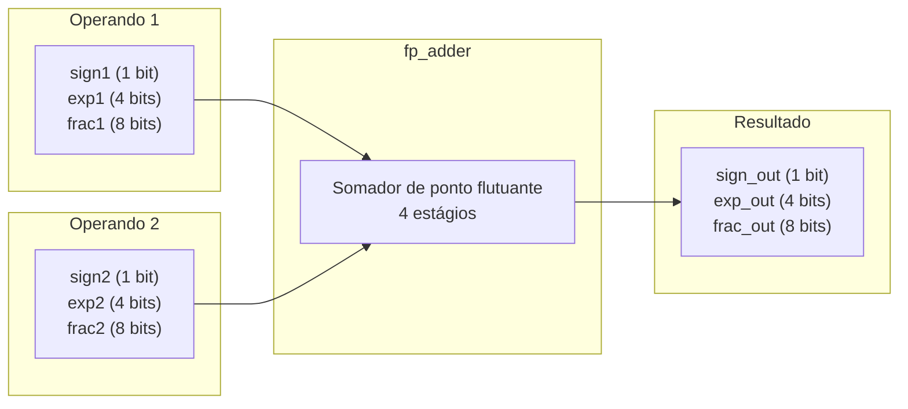
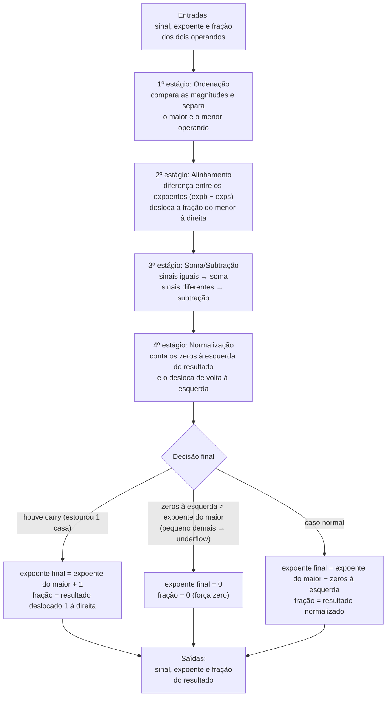

## 2. Descrição gráfica do funcionamento do sistema

Nesta etapa, a descrição gráfica se refere ao código VHDL do somador apresentado no artigo (Pong P. Chu, Listing 3.19, a entidade `fp_adder`). Aqui usamos exatamente as portas do artigo, ainda sem nada específico da placa; a versão com os pinos da DE10 Lite aparece na Parte 3.

O `fp_adder` recebe dois números em ponto flutuante (cada um com sinal, expoente e fração) e devolve um único resultado, também com sinal, expoente e fração.

### 2.1 Diagrama de blocos do somador `fp_adder`

### 2.2 Fluxo interno do núcleo `fp_adder` (4 estágios)

O núcleo é puramente combinacional e reproduz, em hardware, o que se faz no papel
ao somar dois números em notação científica: primeiro descobre qual é o maior,
alinha as casas, soma (ou subtrai) e, no fim, ajusta o resultado de volta à forma
normalizada.

### 2.3 Glossário: do processo ao sinal do código

O texto deste relatório descreve o somador pelo que cada grandeza significa no
cálculo. A tabela abaixo é o único ponto que amarra esses termos aos nomes usados
no VHDL e nas formas de onda, caso você queira cruzar a explicação com o código:

| No processo                          | No código   | O que é                                                            |
| ------------------------------------ | ----------- | ----------------------------------------------------------------- |
| operando maior / menor               | `b` / `s`   | qual dos dois entra como maior e qual como menor após a ordenação |
| expoente do maior / do menor         | `expb` / `exps` | expoentes dos dois operandos depois de ordenados               |
| fração do menor                      | `fracs`     | fração do operando de menor magnitude                             |
| fração do menor já alinhada          | `fraca`     | a mesma fração após o deslocamento do alinhamento                 |
| diferença entre os expoentes         | `exp_diff`  | quantas casas a fração do menor precisa deslizar à direita        |
| resultado bruto da soma (9 bits)     | `sum`       | soma ou subtração das frações, com um bit extra para o carry      |
| bit de carry                         | `sum(8)`    | indica que a soma estourou uma casa a mais                        |
| zeros à esquerda                     | `leado`     | quantos zeros o resultado tem antes do primeiro `1`               |
| resultado normalizado                | `sum_norm`  | resultado já deslocado de volta à esquerda                        |
| expoente final                       | `expn`      | expoente do resultado                                             |
| fração final                         | `fracn`     | fração do resultado                                               |

### 2.4 Sinais de entrada

Cada operando entra no somador com três campos, no formato de 13 bits do artigo:

| Sinal   | Largura | Função                                               |
| ------- | ------- | ---------------------------------------------------- |
| `sign1` | 1 bit   | sinal do operando 1 (`0` = positivo, `1` = negativo) |
| `exp1`  | 4 bits  | expoente do operando 1                               |
| `frac1` | 8 bits  | significando (fração `0.f`) do operando 1            |
| `sign2` | 1 bit   | sinal do operando 2                                  |
| `exp2`  | 4 bits  | expoente do operando 2                               |
| `frac2` | 8 bits  | significando (fração `0.f`) do operando 2            |

### 2.5 Sinais de saída

O resultado sai no mesmo formato de 13 bits:

| Sinal      | Largura | Função                                   |
| ---------- | ------- | ---------------------------------------- |
| `sign_out` | 1 bit   | sinal do resultado                       |
| `exp_out`  | 4 bits  | expoente do resultado                    |
| `frac_out` | 8 bits  | significando (fração `0.f`) do resultado |

---

### 2.6 Validação por simulação (GHDL + GTKWave)

Antes de qualquer adaptação de hardware, o `fp_adder` foi validado isoladamente
com um testbench autoverificável (`tb_fp_adder.vhd`), rodado no GHDL com
visualização no GTKWave. O testbench aplica 7 casos, cada um exercitando um
caminho diferente dos 4 estágios:

| #   | Conta                 | Caminho exercitado                                               |
| --- | --------------------- | ---------------------------------------------------------------- |
| 1   | 128 + 32 = 160        | alinhamento (shift à direita de 2)                               |
| 2   | 192 + 192 = 384       | carry-out no estágio de soma                                     |
| 3   | 192 − 128 = 64        | normalização com 1 zero à esquerda                               |
| 4   | 2,0625 − 2,0 = 0      | underflow (resultado pequeno demais), força zero                 |
| 5   | 8 − 8 = −0            | cancelamento exato (expõe o zero negativo do algoritmo)          |
| 6   | 16384 + 0,996 = 16384 | alinhamento saturado (diferença de expoente ≥ 8)                 |
| 7   | 132 − 128 = 4         | normalização com 5 zeros à esquerda (maior deslocamento testado) |

A simulação terminou com todos os 7 casos aprovados:

#### Observando o 4º estágio (normalização)

O circuito conta os zeros à esquerda do resultado e o desloca de volta à forma
normalizada. Dá para conferir isso nas formas de onda internas do `fp_adder`,
em dois pontos de exemplo (os nomes dos sinais nas imagens seguem o glossário da
seção 2.3: `leado` = zeros à esquerda, `sum_norm` = resultado normalizado,
`expb` = expoente do maior, `expn` = expoente final):

**Caso 3 (1 zero à esquerda):**

O primeiro `1` do resultado aparece uma casa adiante, então a contagem de zeros
à esquerda dá 1. A fração normalizada surge deslocada 1 casa à esquerda em relação
ao resultado bruto, e o expoente final cai uma unidade: 8 − 1 = 7, como esperado.

**Caso 7 (5 zeros à esquerda):**

Aqui são 5 zeros à esquerda, o maior deslocamento entre os 7 testes. A fração
normalizada aparece deslocada 5 casas à esquerda e o expoente final vai de 8 para
8 − 5 = 3. O circuito se comportou da mesma forma em todo o intervalo testado
(0 a 7 zeros à esquerda), inclusive no caso limite.
