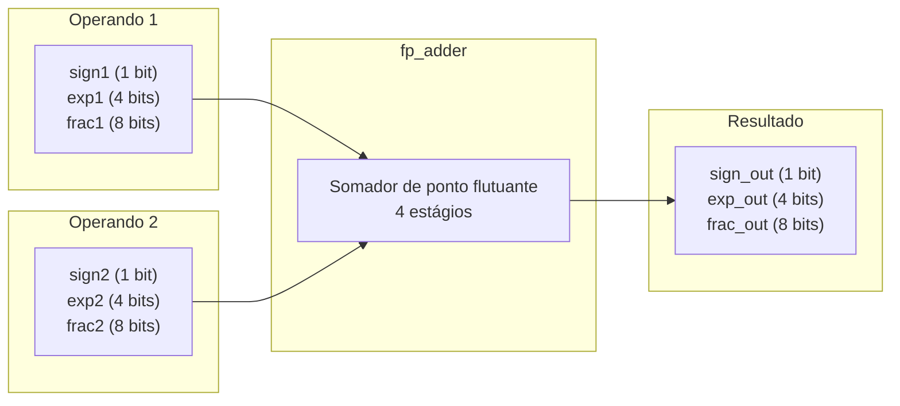
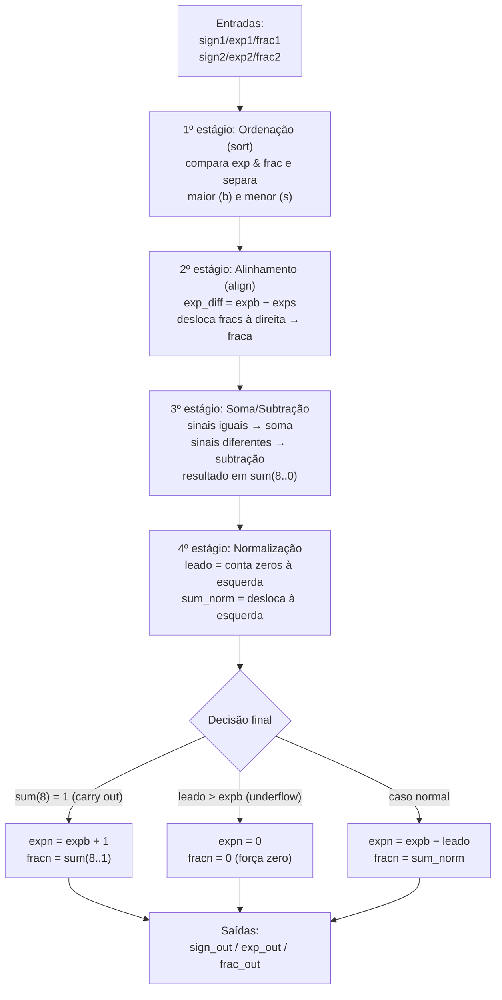

## 2. Descrição gráfica do funcionamento do sistema

Nesta etapa, a descrição gráfica se refere ao **código VHDL do somador apresentado no artigo** (Pong P. Chu, Listing 3.19, a entidade `fp_adder`). Aqui usamos exatamente as **portas do artigo**, ainda sem nada específico da placa; a versão com os pinos da DE10 Lite aparece na Parte 3.

O `fp_adder` recebe **dois números em ponto flutuante** (cada um com sinal, expoente e fração) e devolve **um único resultado**, também com sinal, expoente e fração.

### 2.1 Diagrama de blocos do somador `fp_adder`

### 2.2 Fluxo interno do núcleo `fp_adder` (4 estágios)

O núcleo é **combinacional** e reproduz, em hardware, o que se faz no papel ao somar em notação científica.

### 2.3 Sinais de entrada

Cada operando entra no somador com três campos, no formato de 13 bits do artigo:

| Sinal | Largura | Função |
|---|---|---|
| `sign1` | 1 bit | sinal do operando 1 (`0` = positivo, `1` = negativo) |
| `exp1` | 4 bits | expoente do operando 1 |
| `frac1` | 8 bits | significando (fração `0.f`) do operando 1 |
| `sign2` | 1 bit | sinal do operando 2 |
| `exp2` | 4 bits | expoente do operando 2 |
| `frac2` | 8 bits | significando (fração `0.f`) do operando 2 |

### 2.4 Sinais de saída

O resultado sai no mesmo formato de 13 bits:

| Sinal | Largura | Função |
|---|---|---|
| `sign_out` | 1 bit | sinal do resultado |
| `exp_out` | 4 bits | expoente do resultado |
| `frac_out` | 8 bits | significando (fração `0.f`) do resultado |

---