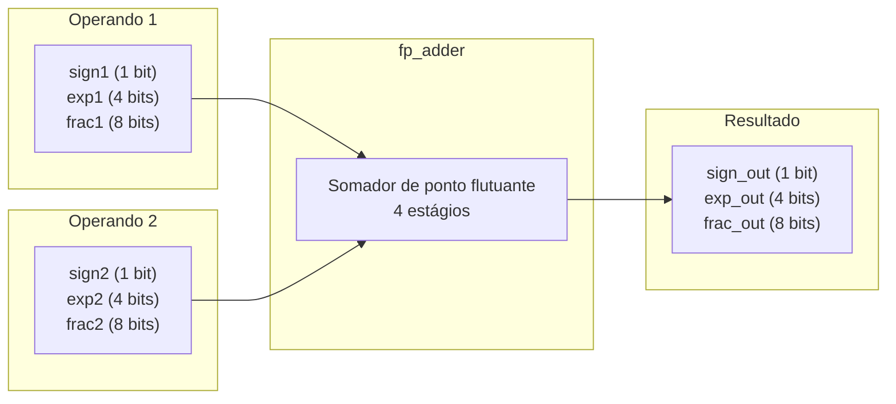
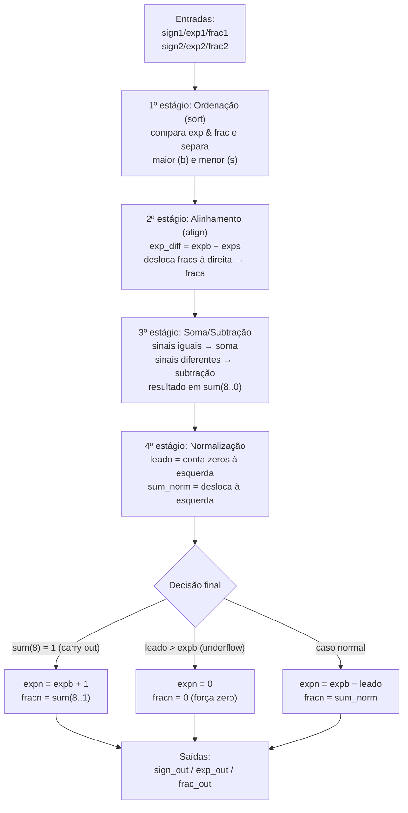

## 2. Descrição gráfica do funcionamento do sistema

Nesta etapa, a descrição gráfica se refere ao **código VHDL do somador apresentado no artigo** (Pong P. Chu, Listing 3.19, a entidade `fp_adder`). Aqui usamos exatamente as **portas do artigo**, ainda sem nada específico da placa; a versão com os pinos da DE10 Lite aparece na Parte 3.

O `fp_adder` recebe **dois números em ponto flutuante** (cada um com sinal, expoente e fração) e devolve **um único resultado**, também com sinal, expoente e fração.

### 2.1 Diagrama de blocos do somador `fp_adder`

### 2.2 Fluxo interno do núcleo `fp_adder` (4 estágios)

O núcleo é **combinacional** e reproduz, em hardware, o que se faz no papel ao somar em notação científica.

### 2.3 Sinais de entrada

Cada operando entra no somador com três campos, no formato de 13 bits do artigo:

| Sinal | Largura | Função |
|---|---|---|
| `sign1` | 1 bit | sinal do operando 1 (`0` = positivo, `1` = negativo) |
| `exp1` | 4 bits | expoente do operando 1 |
| `frac1` | 8 bits | significando (fração `0.f`) do operando 1 |
| `sign2` | 1 bit | sinal do operando 2 |
| `exp2` | 4 bits | expoente do operando 2 |
| `frac2` | 8 bits | significando (fração `0.f`) do operando 2 |

### 2.4 Sinais de saída

O resultado sai no mesmo formato de 13 bits:

| Sinal | Largura | Função |
|---|---|---|
| `sign_out` | 1 bit | sinal do resultado |
| `exp_out` | 4 bits | expoente do resultado |
| `frac_out` | 8 bits | significando (fração `0.f`) do resultado |

---

### 2.5 Validação por simulação (GHDL + GTKWave)

Antes de qualquer adaptação de hardware, o `fp_adder` foi validado isoladamente
com um testbench que se verificava sozinho (`tb_fp_adder.vhd`), rodado no **GHDL** com
visualização no **GTKWave**. O testbench aplica 7 casos, cada um exercitando um
caminho diferente dos 4 estágios:

| # | Conta | Caminho exercitado |
|---|---|---|
| 1 | 128 + 32 = 160 | alinhamento (shift à direita de 2) |
| 2 | 192 + 192 = 384 | carry-out no estágio de soma |
| 3 | 192 − 128 = 64 | normalização com 1 zero à esquerda |
| 4 | 2,0625 − 2,0 = 0 | underflow (`leado > expb`), força zero |
| 5 | 8 − 8 = −0 | cancelamento exato (expõe o zero negativo do algoritmo) |
| 6 | 16384 + 0,996 = 16384 | alinhamento saturado (diferença de expoente ≥ 8) |
| 7 | 132 − 128 = 4 | normalização com 5 zeros à esquerda (maior deslocamento testado) |

A simulação terminou com todos os 7 casos aprovados:

#### Observando o 4º estágio (normalização)

O circuito faz o deslocamento à esquerda e conta os zeros corretamente. Podemos validar  esse ponto observando as formas de onda internas do `fp_adder` (sinais `leado`, `sum`,
`sum_norm`, `expb` e `expn`), em dois pontos de exemplo:

**Caso 3 — 1 zero à esquerda:**

Com `sum` tendo o MSB útil na posição 6, o contador de prioridade acusa
`leado = 1`; `sum_norm` aparece deslocado 1 casa à esquerda em relação a
`sum`; e o expoente final é `expn = expb − leado = 8 − 1 = 7`, exatamente
como esperado.

**Caso 7 — 5 zeros à esquerda:**

Aqui `leado = 5`, o maior deslocamento entre os 7 testes. `sum_norm`
aparece deslocado 5 casas à esquerda e `expn = expb − leado = 8 − 5 = 3`.
O circuito manteve a mesma identidade em todo o intervalo testado
(0 a 7 zeros à esquerda), confirmando que o contador de prioridade e o
deslocador funcionam corretamente inclusive no caso limite.