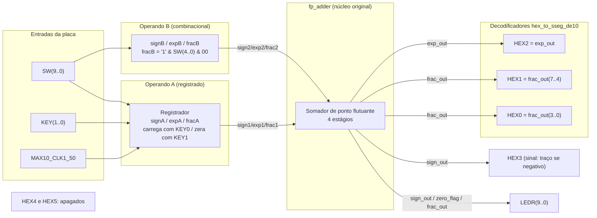

## 3. Adaptações de Hardware (DE10-Lite)

**O que mudamos no VHDL original**

O código do livro foi pensado para uma placa Xilinx antiga, com 8 switches, 4 botões e um display de 4 dígitos multiplexado. Praticamente **toda a parte de entrada e saída precisou ser reescrita** para bater com a DE10-Lite.

A primeira mudança foi **remover o `disp_mux`**. Ele existia porque a placa do livro tinha só 4 displays fisicamente ligados no mesmo barramento, então o circuito precisava alternar entre eles rápido o bastante para parecer que os 4 estavam acesos ao mesmo tempo (multiplexação temporal). A DE10-Lite tem seis displays de sete segmentos totalmente independentes, cada um com seus próprios pinos, e não precisa multiplexar nada.

Junto com isso **saiu o decodificador original (`hex_to_sseg`)**, porque ele usava a ordem de segmentos e a polaridade da placa do livro, que não corresponde à DE10-Lite. No lugar entrou o `hex_to_sseg_de10`, ajustado para os pinos `HEXn(0)=a` até `HEXn(6)=g` e para a lógica ativa em nível baixo (é o `'0'` que acende o segmento nesta placa).

**As portas do módulo de topo também mudaram** por completo: `sw(7 downto 0)` e `btn(3 downto 0)` do livro viraram `SW(9 downto 0)` e `KEY(1 downto 0)` da DE10-Lite, e o barramento multiplexado `an`/`sseg` virou os seis displays independentes `HEX0` a `HEX5`. Também acrescentamos uma saída que não existia no livro, `LEDR(9 downto 0)`, para facilitar a depuração.

**A distribuição dos displays foi combinada com a professora:** `HEX3` mostra o sinal do resultado (apenas o segmento do meio aceso quando é negativo), `HEX2` mostra o expoente, `HEX1` e `HEX0` dividem a fração nos dois nibbles, e `HEX4`/`HEX5` ficaram sem uso. Os LEDs seguem uma lógica parecida: `LEDR(9)` repete o sinal do resultado, `LEDR(8)` acende quando o resultado deu zero, e os 8 restantes mostram a fração em binário puro, pensado para conferir visualmente o que o somador está calculando durante os testes práticos.

A mudança mais estrutural, porém, foi **transformar o operando A num registrador** em vez de mantê-lo fixo. Com só 10 switches na placa, não dá para controlar os 26 bits dos dois operandos ao mesmo tempo, então A passou a ser carregado com `KEY0` (copia o valor atual das chaves) e limpo com `KEY1`. Foi essa mudança que abriu a possibilidade de testar qualquer par de números, inclusive os casos mais extremos, como carry-out e deslocamento grande na normalização.

Por fim, o bit mais significativo da fração do operando B foi travado em `'1'` (`fracB <= '1' & SW(4 downto 0) & "00"`), para garantir que a entrada sempre chega normalizada, como o formato exige.

Todas essas mudanças ficaram restritas ao módulo de topo: o `fp_adder.vhd`, com **a lógica matemática do somador, não foi tocado**. Isso foi proposital: manter o núcleo intacto significa que tudo o que validamos na simulação da Etapa 1 continua valendo, sem precisar refazer nada, na placa de verdade.

**O netlist sintetizado (RTL Viewer)**

Depois de compilar, podemos abrir o RTL Viewer do Quartus e ver exatamente o que ele montou a partir do VHDL: não é mais código, é o circuito de portas e registradores de verdade que o compilador sintetizou. As duas capturas abaixo são desse visualizador, tiradas numa versão intermediária do projeto, de antes do ajuste combinado com a professora (o que tirou o monitor do operando A dos displays e deixou só o resultado ocupando `HEX0` a `HEX3`). Mesmo assim vale a pena mostrar, porque podemos enxergar de um jeito bem mais concreto boa parte do que só descrevemos em texto até aqui.

Na primeira imagem (abaixo) podemos ver o circuito inteiro de uma vez:

- À esquerda, os três blocos de mux + registrador (`expA`, `signA`, `fracA`) são exatamente o processo do registrador do operando A, só que "desmontado" pelo sintetizador: cada bit passa primeiro por um multiplexador que decide entre manter o valor atual ou carregar um novo (a estrutura `if KEY(1)='0' ... elsif KEY(0)='0' ...` virou dois níveis de mux em cascata), e só depois entra no flip-flop de verdade, o bloco com `CLK` e `SCLR` (clock e clear síncrono).
- No meio, o bloco verde `fp_adder:fp_add_unit` é o núcleo somador entrando como componente. O RTL Viewer não abre ele por padrão nessa visão, só mostra a caixa com a lista de portas (`exp1`, `exp2`, `frac1`, `frac2`, `sign1`, `sign2` entrando; `exp_out`, `frac_out`, `sign_out` saindo).
- Ainda no meio, o círculo `Equal0` é a verificação de resultado zero virando, literalmente, um comparador de igualdade contra a constante `8'h0`: essa é a peça de hardware que gera o `zero_flag` usado no `LEDR(8)`.
- À direita, cinco instâncias do `hex_to_sseg_de10`. Nessa versão, duas delas (`disp_exp_a` e `disp_frac_a`) ainda decodificavam o operando A registrado para os displays `HEX1` e `HEX0` (o monitor do operando que depois foi retirado). O sinal do resultado, por sua vez, saía por um inversor isolado (rotulado `HEX5[6]~not`) direto pro `HEX5`, em vez de passar por um decodificador: o mesmo truque de acender só o segmento do meio que hoje está no `HEX3`, só que endereçado pra outra saída física nessa versão.

Na segunda imagem, a árvore do "Netlist Navigator" (painel da esquerda) está expandida até dentro do `fp_adder:fp_add_unit`, e dá pra ver uma peça isolada do 4º estágio: um mux rotulado `expn~[7:4]`. Essa é a lógica de decisão do expoente final do `fp_adder.vhd`, a que escolhe entre carry-out, underflow ou caso normal, já sintetizada como hardware mesmo: um multiplexador selecionando entre as três opções calculadas em paralelo.

> **Nota:** essas duas capturas são de antes da simplificação dos displays combinada com a professora, então os nomes dos sinais e o mapeamento de saídas aqui não batem 100% com o código final da Seção 4 (`HEX0` e `HEX1` aqui mostram o operando A, e o sinal sai por `HEX5` em vez de `HEX3`). O circuito por trás (o registrador de A, o núcleo `fp_adder`, o comparador de zero) é o mesmo; só a fiação de saída para os displays mudou depois, quando o operando A deixou de ser mostrado.

**Descrição gráfica do sistema**

_Diagrama com as portas reais da placa (módulo de topo `fp_adder_de10lite`), refletindo o mapeamento de displays pedido pela professora (`HEX3..HEX0`, com `HEX4`/`HEX5` apagados)._

